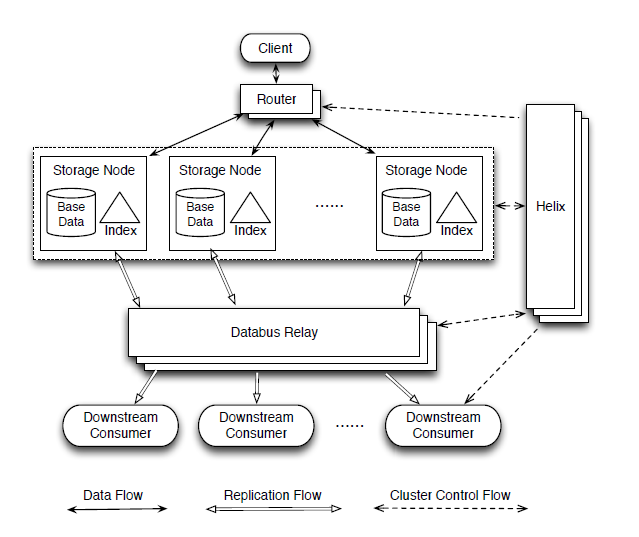

# On Brewing Fresh Espresso: LinkedIn’s Distributed Data Serving Platform

*A timeline-consistent document-oriented distributed database to address Linkedin's requirements for primary store.*

## Background

- **Timeline Consistency**: events are applied in the same order on all replicas.
- Linkedin used to have a single RDBMS with user data tables and two derived data systems(full-text search and relationship graph traversal) kept up-to-date by Databus.
- RDBMS has pain points like scaling and schema management, while most Linkedin primary data does not require full RDBMS functionality.
- Voldemort, a simple eventually-consistent key-value store, was initially introduced for derived data, but is increasingly being used for primary data.

## Data Model

- There are two primary forms of relationships, nested entities and independent entities. Applications tend to need atomicity constraints for updating nested entities, but not for independent entities(changes should eventually happen though).
- Espresso uses a hierarchical data model to model nested entities efficiently. Independent entities are modeled as disjoint entities with change capture stream to materialize relationship.
- The data hierarchy is composed of document, table, document group and database.

## System Architecture

## Implementation

### Secondary Index

