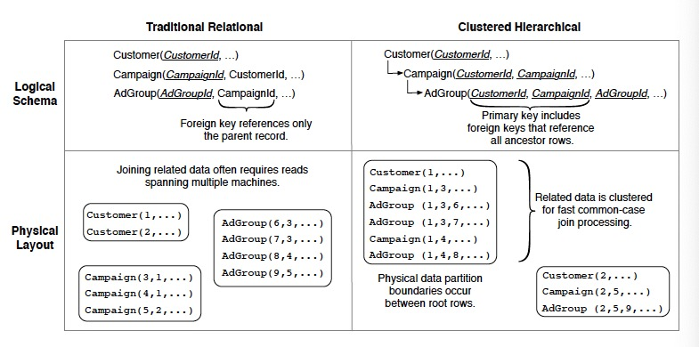

# F1: A Distributed SQL Database That Scales

*A hybrid database that combines high availability, the scalability of NoSQL and consistency of traditional SQL.*

## Basics

- MySQL can't to meet scalability and reliability requirements as it is hard to scale up and rebalance.
- F1 is built on Spanner, which provides scalable data storage, synchronous replication, strong consistency and ordering properties.
- F1 has higher latency for typical reads and writes, so many techniques(even a new ORM layer) are used to hide the latency.

## Architecture

- F1 servers are typically co-located in the datacenters as the Spanner servers storing the data.
- F1 servers can communicate with Spanner servers outside their own datacenters for availability and load balancing.
- Shared slave pool consists of F1 processes to execute distributed query plans.
- F1 master monitors slave process health and distributes the list of available slaves to F1 servers.

## Features

### Hierarchical Schema

- Logically, tables in the F1 schema can be organized into a hierarchy. Physically, F1 stores each child table clustered with and interleaved within the rows from its parent table(the child table must have a foreign key to its parent table as a prefix of its primary key).
- Reading all AdGroups for a Customer can be expressed as a single range read.
- Hierarchical clustering is useful for updates since it reduces the number of Spanner groups involved in a transaction.
- Flat schema is possible, but hierarchy matching data semantics is beneficial(most transactions update data for a single advertiser).

### Non-blocking Schema Changes

A schema change algorithm that:

- Enforcing across all F1 servers, at most twoschemas("current" and "next") are active.
- Dividing schema change into multiple phases where consecutive pair of phases are compatible and cannot cause anomalies.

### Optimistic Transaction

- F1 implements three types of transactions:
  - snapshot(read-only).
  - pessimistic(Spanner transaction that requires lock).
  - optimistic(arbitrary long read phase without lock + short write phase with lock).
- Benefits: tolerating misbehaved clients, long-lasting transactions, server-side retriability, server failover, speculative writes.
- Drawbacks: insertion phantoms, low throughput under high contentions.

### Change History

- Every transaction creates ChangeBatch protocol buffers and they are written to change history tables that exist as children of root tables.
- Change History can be used to trigger incremental processing when root rows change or update cache.

## Query Processing

- F1 supports both centralized and distributed execution of queries.
  - Centralized execution is for OLTP queries and runs on one F1 server.
  - Distributed execution is for OLAP queries and spreads workload in the slave pool.
- F1 mainly uses remote data source, so it optimizes to reduce network latency with batching or pipelining data access(example: Lookup Join operator), while traditional database optimizes to reduce disk latency.
- F1 operators stream data as much as possible at the cost of not preserving data orders.
- F1 uses only hash partitioning. Range partitioning is infeasible because Spanner applies random partitioning.
- F1 operators execute in memory without checkpointing to disk, so queries run fast but will fail when any part fails(transparent retry hides these failures).
- Protocol buffers have performance implications since we have to fetch and parse entire message even when using a subset of fields.