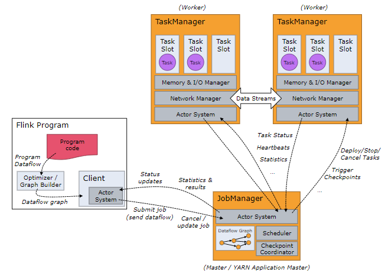

# Apache Flink: Stream and Batch Processing in a Single Engine

*A unified system for stream and batch data processing.*

## Introduction

- Data processing systems usually treat streams as batches, ingoring the timely and continuous nature of data production.
- Flink embraces stream processing as the unified model in programming model and execution engine. Different types of computations  start processing at different points in a durable stream and maintain different forms of states.
- Flink uses a streaming dataflow engine as the core runtime engine, and builds stream and batch APIs on top.

## System Architecture

- A Flink cluster has three types of processes: client, JobManager and TaskManager.
- Client transforms program code to dataflow graph and submits to Job Manager.
- JobManager coordinates the distributed execution of the dataflow. It tracks the state and progress of each
  operator and stream, schedules new operators, and coordinates checkpoints and recovery.
- TaskManager executes one or more operators that produce streams, and reports on their status to JobManager. The TaskManagers maintain the buffer pools to buffer or materialize the streams and the network connections to exchange data streams between operators.

## Common Fabric

- All Flink programs compile down to dataflow graphs. A dataflow graph is a DAG of stateful operators and intermediate data streams(may or may not be materialized on disk) for data exchange.
- Intermediate data streams can be pipelined (to avoid materialization) or blocking (to split production and consumption into different stages).
- Producer stores data records in buffers. A buffer is sent to a consumer when (1) it is full or (2) timeout. Latency/throughput can be configured with buffer size.
- Operators may ingest control events(checkpoint barriers, watermarks, iteration barries) in the data stream. For example, Flink uses Asynchronous Barrier Snapshotting(ABS) to take a consistent snapshot of all operators without halting the execution.
- Flink offers exactly-once-processing and deals with failures via checkpointing and partial re-execution.
- Flink does not provide ordering guarantees and operators are responsible for dealing with out-of-order records.