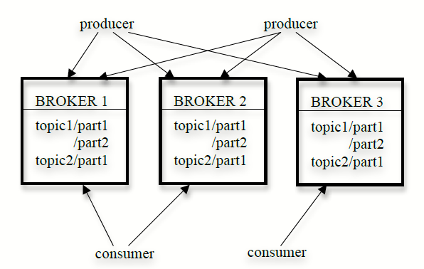

# Kafka: a Distributed Messaging System for Log Processing

*A distributed messaging system for collecting and delivering high volumes of log data with low latency.*

## Background

- Online and offline log consumption has been a critical component of data pipelines. The volume of log data is orders of magnitude larger than "real" data because of enrichments and annotations.
- Traditional log aggregators physically scraps log files off production servers for analysis, which does not support real-time applications.
- Messaging systems tend not to be a good fit for log processing because of limited throughput, weak distributed support and assuming a small queue of unconsumed messages.

## Architecture

- A topic is divided into multiple partitions; each partition is stored as a set of segment files(e.g. 1GB) at brokers.
- A producer publishes messages to a topic. The broker appends the received message to the last segment file.
- A consumer subscribes to one or more topics and pulls messages from the brokers.
- A consumer group jointly consumes a set of topics; each message is delivered to only one consumer. Coordination and state persistence(ownership, offset) are done via Zookeeper.
- In general, Kafka only guarantees at-least-once delivery.

## Design choices

- Each message is addressed by the logical offset rather than message id, which avoids the overhead of maintaining index.
- Kafka relies on file system page cache instead of explicit caching messages, which avoids double buffering and is leverages operating system caching heuristics(write-through caching and read-ahead).
- Optimize the network access by using `sendfile()` API, which directly transfer bytes from a file channel to a socket channel.
- Pull model simplifies broker(as offset is maintained by consumer) and allows consumer to rewind back to an old offset and re-consume data. Kafka
- Kafka simplifies coordination of consumer group by: (1) allowing only one consumer to consume a partition at any given time(over-partition if necessary) and (2) let consumers coordinate via Zookeeper in a decentralized fashion.