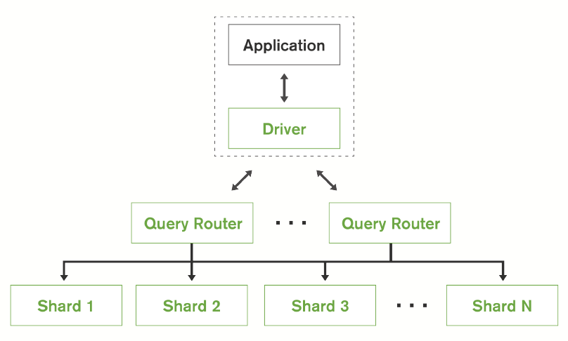

# MongoDB

*A document-based distributed database for modern applications.*

## Background

- Relational databases cannot well handle massive volumes of semi-structured or unstructured data.
- Organizations are turning to scale-out architecture with commodity servers instead of large monolithic servers.
- Applications (and therefore the databases) must be always-on and scaled globally.

## Data Model

- MongoDB stores data as self-describing documents in BSON (binary JSON) format. Typically a document has all information for a record (therefore less need for JOIN), while in relational database information for a record is spread across tables.
- Fields can vary from document to document, but user can also enforce certain checks.
- Documents with similar structure are organized as collections (like tables in relational databases).
- Query model is implemented as APIs instead of separate language for simpler integration with applications.

## Architecture

- Data is automatically sharded across machines by range, hash or user configuration.
- Applications issue queries query routers, which dispatches queries to appropriate shards and aggregate results.
- At any time data is replicated at one primary and multiple secondaries. Oplog (ordered set of idempotent operations of database modifications) on primary are replicate to and replayed on secondaries.
  - When primary fails, secondaries use Raft algorithm to elect a new primary.
  - When secondary is down for a while or a new member joins the replica set, either Oplog or initial synchronization (copying all data and Oplog) can be used for catch-up.

## Features

- MongoDB is ACID-compliant at the document level.
- Storage engines support native compression to reduce physical storage footprint and enable higher I/O scalability.