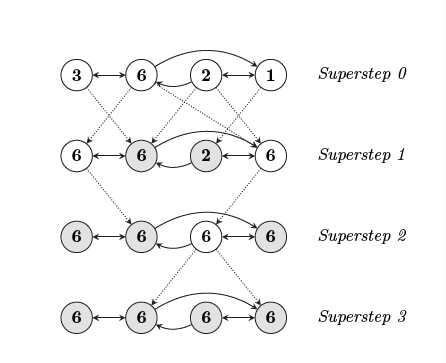

# Pregel: A System for Large-Scale Graph Processing

*A scalable and fault-tolerant computational model for distributed processing of large graphs.*

## Background

- Graph algorithms often exhibit poor locality of memory access, ittle work per vertex, and a changing degree of parallelism.
- There is no general-purpose system for implementing arbitrary graph algorithms over arbitrary graph representations in a large-scale distributed environment.

## Computation Model

- A Pregel program has input to initialize graph, supersteps separated by global synchronization points and output.
- Each vertex/edge has an identifier and a modifiable user-defined state. The edges are associated with source vertices.
- Pregel uses message passing model, so latency is amortized by batching messages. In a superstep,
  - Pregel invokes a user-defined function `Compute()` for each vertex $V$, conceptually in parallel.
  - `Compute()` can read messages sent to $V$ in superstep $S-1$, send messages to other vertices that will be received in superstep $S + 1$, and modify the state of $V$ and its outgoing edges.
- $V$ may deactivate itself(if no further work) or be reactivated by a message. The program terminates when vertices are inactive and there are no messages in transit.
- Pregel supports aggregators for global information. Each vertex provides a value to an aggregator in superstep $S$, the system aggregates received values and the result is made available to all vertices in superstep $S+1$.
- Users can define combiners to combine several messages for a vertex, thus reducing the number of messages must be transmitted and buffered.

## Implementation

- A Pregel program runs as one master and multiple workers.
  - For initialization, the master assigns a part of graph and user input to each worker.
  - For supersteps, a worker calls `Compute()` for each active vertices. Messages are sent asynchronously but delivered before the end of superstep. A worker also maintains partially reduced aggregators for its parts.
  - At the end of each superstep, workers form a tree to reduce partially reduced aggregators into global values and send to the master. Compared with pipelining with a chain of workers, tree-based reduction can parallelize the use of CPUs.
- **Scalability:** The size of the master's data structures is proportional to the number of partitions instead of vertices/edges.
- **Fault-tolerance**: The master instructs workers to checkpoint states at the beginning of a superstep. If detecting failed workers via pings, the master reassigns graph partitions and let workers restart from the most recent checkpoint.