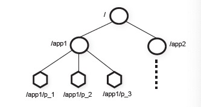

# ZooKeeper: Wait-free coordination for Internet-scale systems

*A service for coordinating processes of distributed applications.*

## Basics

- ZooKeeper provides a coordination kernel for clients to implement primitives for configuration, group membership, leader election and distributed lock.
- ZooKeeper implements non-blocking API, so a client can have multiple outstanding operations at a time.
- ZooKeeper guarantees FIFO client ordering for all operations and linearizable writes.
- ZooKeeper target workload read to write ration is 2:1 to 100:1.

## Service Overview

### znode

- ZooKeeper provides the abstraction of a set of data nodes(znodes) organized by hierarchical namespaces.
- znodes are in-memory data node stored in ZooKeeper. A znode can be regular or ephemeral(automatically removed when corresponding session terminates).
- znodes are not for general data storage. Instead, they are used to store metadata or configuration of applications(typically 1MB).

### Client API

- ZooKeeper provides API for client to manipulating znodes like in a file system.
- For read methods, ZooKeeper implements watches to allow client to receive notification of changes.  Watches are one-time triggers associated with a session(for example, `getData(path, watch)`).
- For write methods, ZooKeeper accepts an optional expected version number(for example, `setData(path, data, version)`). If set, the write succeeds only if the actual version number of znode matches the expected one.
- ZooKeeper client maintains session with ZooKeeper through heartbeat messages.

## Implementation

- ZooKeeper service comprises an ensemble of servers that each has replicated ZooKeeper data. One is leader and the rest are followers.
- Read requests are handled locally at each server, so it may return stale data since some committed transactions are not applied on that server yet.
- Write requests are forwarded to leader. Leader (1) calculates the new system state to transform write requests into idempotent transactions and (2) broadcast the state changes to other servers through atomic broadcast protocol ZAB.
- ZooKeeper uses TCP so message order is maintained by network.
- ZooKeeper uses replay log and periodic snapshots for recoverability. ZooKeeper state is not locked when taking the snapshot, but idempotent transactions can be applied twice as long as in order.

